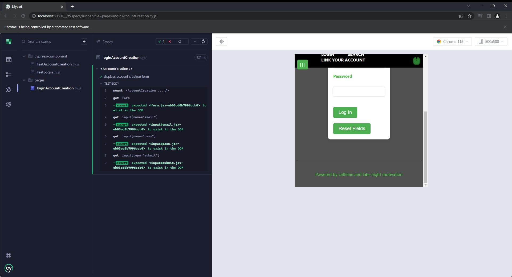
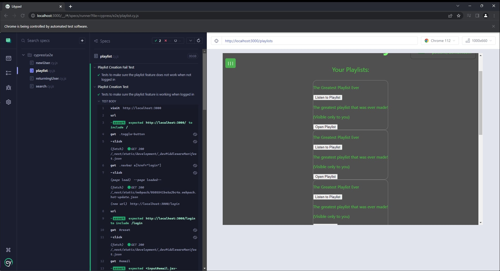

# CS386 Team 6 Deliverable 7

### Team Members:
Alan Hakala, Gannon Rowlan, Isaac Faulkner, Nathan Seitz, Rino De Guzman, Vamshi Vavilla

## 1: Description
LilyPad is a website that provides listeners with a single place to link together their favorite songs, playlists, platforms, and artists. The site provides users a way to search for songs, put them into their own playlists, and listen to them. The unique factor of LilyPad comes from the fact that it connects all the popular platforms together, meaning songs exclusive to Spotify can appear in playlists right alongside songs from Youtube and Apple Music.

## 2: Verification (tests)
### 2.1: Unit Test
  2.2.1: Cypress JS  
  2.2.2: https://github.com/CS386Team6/LilyPad/tree/main/pages  
  2.2.3: In this test case, we're mounting the AccountCreation component using cy.mount, and then using Cypress selectors to ensure that the form and its inputs are              present in the DOM. Once mounted, we check to make sure the form itself and the input fields, such as the email and password, actually exist.
         https://github.com/CS386Team6/LilyPad/blob/main/pages/loginAccountCreation.cy.js  
  2.2.4: 

### 2.2: Acceptance Test
  2.2.1: Cypress JS  
  2.2.2: https://github.com/CS386Team6/LilyPad/tree/main/cypress/e2e  
  2.2.3: This test is responsible for making sure that the user is able to create a playlist correctly when logged in, but not when logged out. There are two different            tests that both require going to the playlist page of the site and attempting to create a playlist. The only difference is the first test runs without logging            in and ultimately does not create a playlist, whereas the second test logs in first.
         https://github.com/CS386Team6/LilyPad/blob/main/cypress/e2e/playlist.cy.js  
  2.2.4: 
         
## 3: Validation (user evaluation)

### Script

The script consisted of a series of tasks, supplemented by a handful of questions. These tasks and questions were designed to help us understand how easy navigation is in our system, what users like in the system, and what users didn't like in the system. The rough script is as follows:

(Task) Make an account/Log In

(Task) Search for a song

(Task) Make a playlist

(Task) Add some songs to the playlist

(Task) Listen to the songs you just added

(Question) How do you like the design of the website?

(Question) What do you like overall?

(Question) What don’t you like overall/wasn’t covered?

### Results

Users were always able to follow the general tasks, but sometimes struggled with small details, like navigating away from a viewed playlist or finding the spot to listen to songs.

All three interviewees found the website to be mostly easy to navigate, and no confusion was had regarding which buttons did what.

We receieved an exceptional amount of feedback for future expansion and updates to the site. Most notably, users seemed very interested in searching for playlists, listening to just a single song at a time, and organization of the search results being more clear.

Nearly all critique was directed towards the visual and interactive design of the site, which suggests future efforts should be more focused on providing a clean user experience.

### Reflections

Nearly no complaints were directed toward the search feature. Users found it easy to use and intuitive. Additionally, account creation and login were two steps of the script that users never struggled on.

Thanks to our system being a website and being able to follow traditional design patterns for a website, users were able to quickly pick up and understand the format of our site, leading to nearly no issues in navigation.

The visual design can be improved significantly. Every user had at least one comment on the way things were formatted or visually designed. Some users felt that the project looked like it was built for mobile, and others complained about the color scheme being jarring in some places. Despite its easy navigation, our website could stand to benefit from a refocus on user-friendliness and overall pleasant UI design.

Our value proposition has been fulfilled partially. We were able to deliver a working product that provides users with a way to combine music platforms, but time constraints meant we were not able to reach full playlist functionality, so our platform is not a complete alternative yet.
