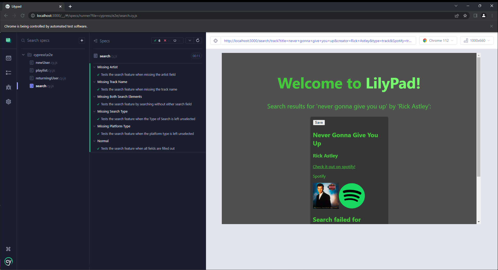

# CS386 Team 6 Deliverable 6

### Team Members:
Alan Hakala, Gannon Rowlan, Isaac Faulkner, Nathan Seitz, Rino De Guzman, Vamshi Vavilla

## 1: Introduction

## 2: Implemented Requirements

## 3: Tests
3.1.1: Cypress JS

3.1.2: https://github.com/gannonrowlan/Lilypad/tree/main/cypress/e2e

3.1.3: Testing to make sure the search function works according to the infrmation provided in several fields. 
https://github.com/CS386Team6/LilyPad/blob/main/cypress/e2e/search.cy.js  -- This is the cypress test
https://github.com/CS386Team6/LilyPad/tree/main/pages/search -- The search folder is what is being tested

3.1.4: 

## 4: Demo

## 5: Code Quality

## 6: Lessons Learned
