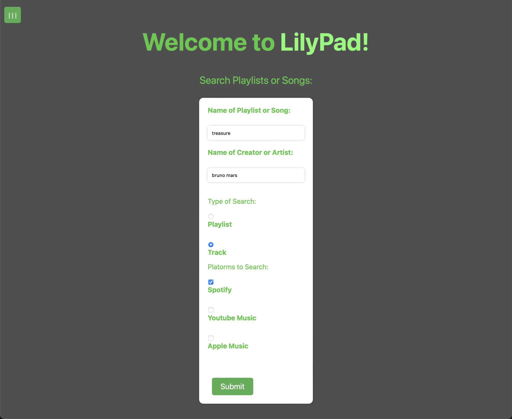
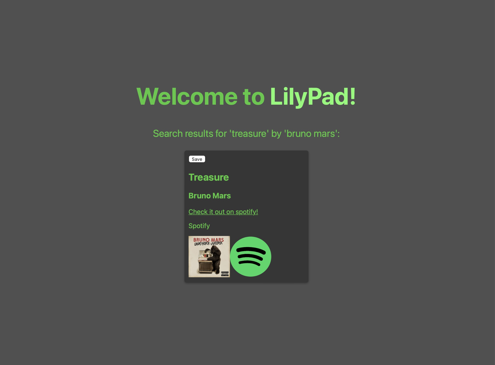
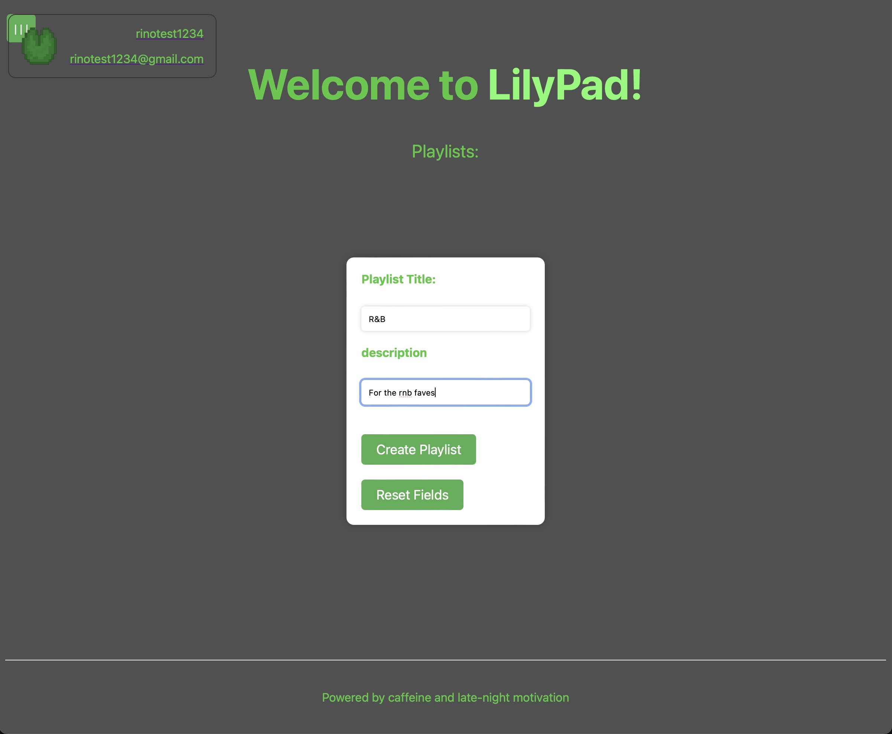
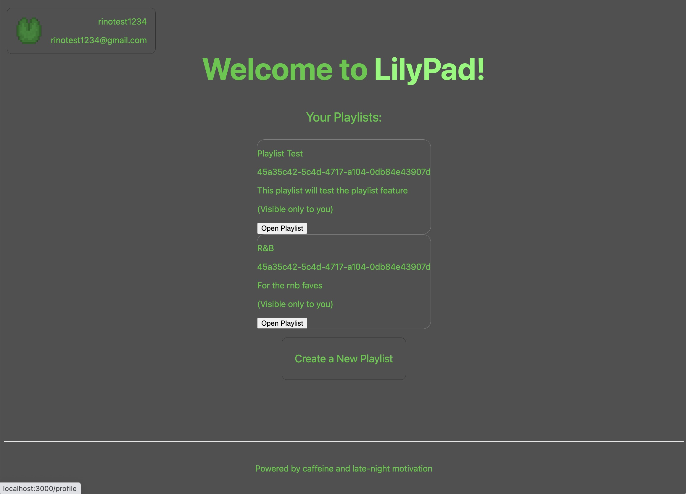
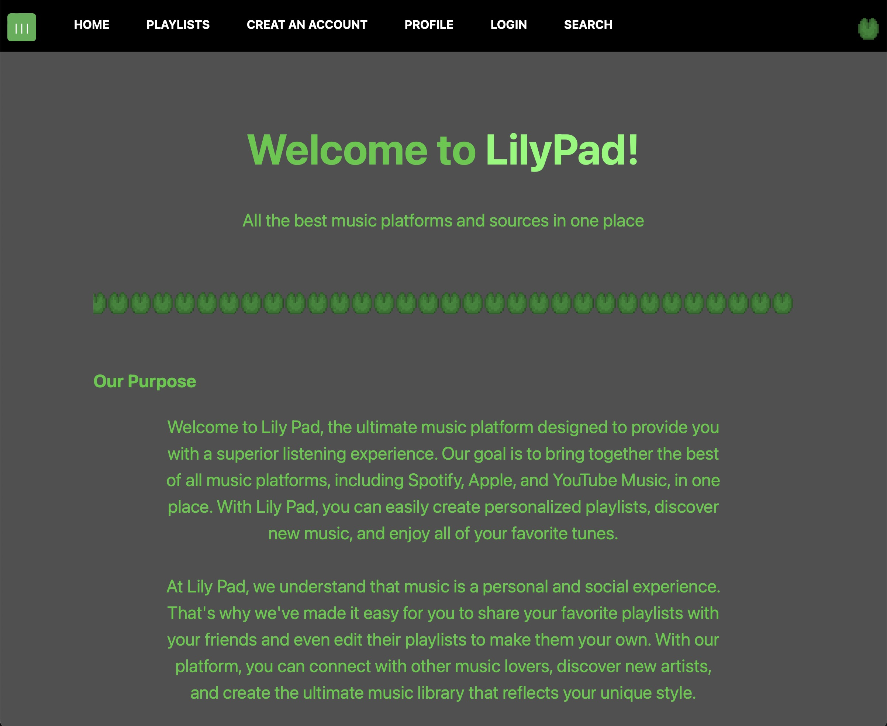
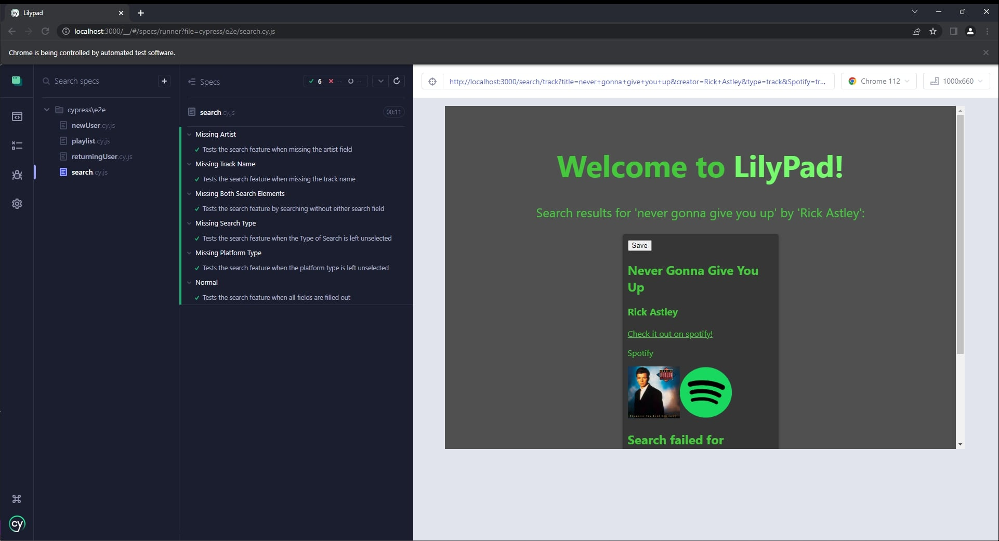

# CS386 Team 6 Deliverable 6

### Team Members:
Alan Hakala, Gannon Rowlan, Isaac Faulkner, Nathan Seitz, Rino De Guzman, Vamshi Vavilla

## 1: Introduction
LilyPad is a web based application that brings users songs and playlists from popular streaming platforms together all in one place. In a perfect world everyone could listen to any music they wanted all on one streaming platform, but such a platform is unrealistic with the streaming industry dominated by competing multibillion dollar platforms. LilyPad offers a solution to this by combining the largest existing music platforms. Users can search, create playlists, and stream music from Spotify, Apple Music, and Youtube Music on the same website. Whether you’re looking for a song from a small artist not on a big platform like Spotify, or want songs you’ve purchased on Apple Music in a playlist with remixes only on Youtube, LilyPad can host all your songs in one place without having to switch between sites. Everything from creating playlists with songs from multiple platforms, searching for tracks across different platforms, and streaming from different platforms is possible. Creating a user-friendly experience that solves a common issue present in streaming service

Value Proposition:  

LilyPad is a website/app that provides avid music listeners with an easy way to link all their favorite songs and playlists, across multiple platforms, ensuring you never need to go to more than one place for your favorite music ever again.  

Consumer Segment:  

People who stream digital music and use more than one platform regularly.

## 2: Implemented Requirements
Requirements: As a music lover, I want to be able to search for songs so that I can easily add them into my playlist  
Issue: https://github.com/CS386Team6/LilyPad/issues/17  
Pull request: https://github.com/CS386Team6/LilyPad/pull/52  
Implemented by: Nathan Seitz  
Approved by: Nathan Seitz  

----
Requirement: As a music lover, I want to be able to create playlists so that I can organize my favorite songs the way I want to.  
Issue: https://github.com/CS386Team6/LilyPad/issues/9  
Pull request: https://github.com/CS386Team6/LilyPad/pull/49  
Implemented by: Alan Hakala  
Approved by: Nathan Seitz  

----
Requirement: As a music listener, I want to be able to listen to tracks from my connected platforms so that I can enjoy my favorite music  
Issue: https://github.com/CS386Team6/LilyPad/issues/63  
Pull request: https://github.com/CS386Team6/LilyPad/pull/62  
Implemented by: Rino De Guzman & Nathan Seitz  
Approved by: Nathan Seitz  

----
Requirement: As an app user, I want to easily be able to navigate throughout the website so that it can be easier for me to listen to my favorite music  
Issue: https://github.com/CS386Team6/LilyPad/issues/12  
Pull request: https://github.com/CS386Team6/LilyPad/pull/45  
Implemented by: Gannon Rowlan & Isaac Faulkner  
Approved by: Nathan Seitz   

## 3: Tests
3.1.1: Cypress JS

3.1.2: https://github.com/gannonrowlan/Lilypad/tree/main/cypress/e2e

3.1.3: Testing to make sure the search function works according to the infrmation provided in several fields. 
https://github.com/CS386Team6/LilyPad/blob/main/cypress/e2e/search.cy.js  -- This is the cypress test
https://github.com/CS386Team6/LilyPad/tree/main/pages/search -- The search folder is what is being tested

3.1.4: 

## 4: Demo

## 5: Code Quality
   Our team decided early on that we would mostly build our app using javascript, utilizing Next.js over react. This was our first decision we made in an effort to manage code quality. Next.js simply requires less code than react, and many of us were new to javascript, making the decision to use Next.js over the base react library made our code more compact, and lessened the learning curve.  
   
   Another policy/convention that our team quickly adopted was standardization in formatting. Getting the basics out of the way, we all agreed upon using self identifying variable and function names. Variables describe their contents and the context in which they are used if applicable, and function names are verbs or names that clearly indicate they are functions that perform an action. Javascript being heavy on brackets, curly braces,and parentheses to organize code led us to standardize how we handle this issue. Functions, conditional checks, and fetch requests all have their respective starting character(s) that denote the following code block on the same line in which they are first created; their closing characters are kept on their own line directly below the final line of code. Code in a block is indented, however the grouping characters that denote said block are not indented. Grouping characters are only indented if they denote a block of code inside another block of code.  
   
   Another decision that was made to maintain compact and easy to read code was to use Prisma. Prisma is a query builder built for node.js, which is what our library of choice, Next.js, runs on. Prisma was chosen for keeping code compact and easy to read, as its syntax is both more concise and visually cleaner than basic SQL. Much like javascript was new to many members of the team, dealing with a postgres database was new to most of the team, making Prisma an optimal choice.

## 6: Lessons Learned
One of the biggest takeaways we have had from this project is the many complications that can come from doing a project beyond the scale of just yourself. Many of us had no prior experience coding something that would take more than maybe a week’s worth of work, so to scale the workload to a multi month project too big to complete by ourselves was a challenging and new experience for many of us. We all learned to be more cohesive as a team, it was a common occurrence that one person’s work depended on another’s being complete for them to progress. Having interdependency between all of our areas we were working on forced us to keep pace with each other, and collaborate to help move the project to its next phase. Another thing we learned was how to critically read and review code, so that we could effectively finish the same code, or build on top of it.  

Another important set of things we all had to learn was being efficient and comfortable with automated testing and github. While we had all had some small experience using github in the past, using github for a real project that required keeping everything organized and functional was a new experience. After the initial learning phase was over we all quickly learned the many benefits of github and automated testing. Testing ensured that our app was always functional when a pull request was accepted, preventing otherwise small mistakes from causing problems in our teammates' work. The basic github practices like creating and reviewing pull requests gave different quality assurance people each week the opportunity to learn how to critically read code, and gave us the added benefit of having at least one person every week who was knowledgeable on all the changes being made to consult.

