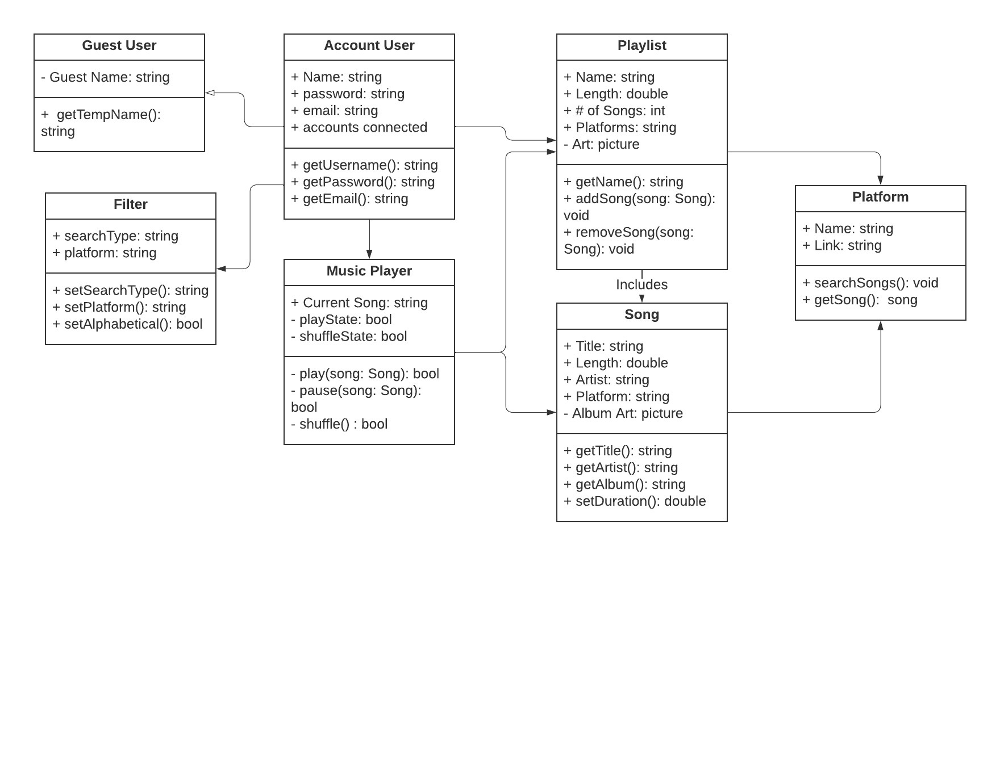
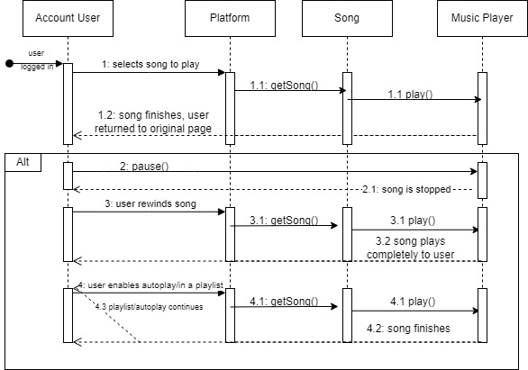
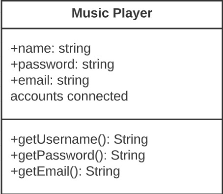

# CS386 Team 6 Deliverable 5

### Team Members:
Alan Hakala, Gannon Rowlan, Isaac Faulkner, Nathan Seitz, Rino De Guzman, Vamshi Vavilla

## 1: Description
LilyPad is a website that provides listeners with a single place to link together their favorite songs, playlists, platforms, and artists. The site provides users a way to search for songs, put them into their own playlists, and listen to them. The unique factor of LilyPad comes from the fact that it connects all the popular platforms together, meaning songs exclusive to Spotify can appear in playlists right alongside songs from Youtube and Apple Music.

## 2: Architecture
The architecture of our project is somewhat standard for Next.js apps. We have a user interface and an api that users can use to interact with the project. The api can interface with the backend server of the project, in order to make api calls to external music platforms. The server also uses Prisma to make changes in the project database, when it becomes necessary. The server interacts with node.js, to provide package support throughout the app.

## 3: Class Diagram

## 4: Sequence Diagram

Use-Case: Listening to Songs
1. Description
The user listens to a song.

2. Actor Description
2.1: Registered User

3. Preconditions
The user has logged in.

4. Main Flow
1: The use case begins when the user selects a song to start listening to. 2: The song starts playing. 3: The song plays unless skipped, paused, or rewinded. 4: The song finishes playing. 5: The use case ends.

5. Alternative Flows
5.1: Song is paused by the user. If in steps 2-4 of the basic flow the listener selects pause, then 1: The use case is suspended until cancelled or it starts again.

5.2: Song is rewinded by user. If in steps 2-4 of the basic flow the listener selects rewind, then 1: The use case restarts at step 2 and proceeds as normal.

5.3: Next song starts playing. If in step 4 the listener is listening to a playlist or has autoplay enabled, then 1: The use case starts at step 2 with the next song in the queue.

6. Subflows
No Subflows for this use case.

7. Key Scenarios
The listener presses play on the song. The listener selects a song to listen to. The listener queues a next song or enables autoplay. The listener selects a playlist to start listening to.

8. Post-Conditions
The song player closes, bringing the listener back to the page they were on before.

9. Special Requirements
No Special Requirements for this use case.

## 5: Design Patterns
The first design pattern of the two used is the Singleton. A singleton restricts the instantiation of a class to one object. In this case, we only want one object of a music player. Whenever the user clicks play, pause, or skip, it will alter the state of the object.
 \
Music Player: https://github.com/CS386Team6/LilyPad/tree/main/prisma

## 6: Design Principles
