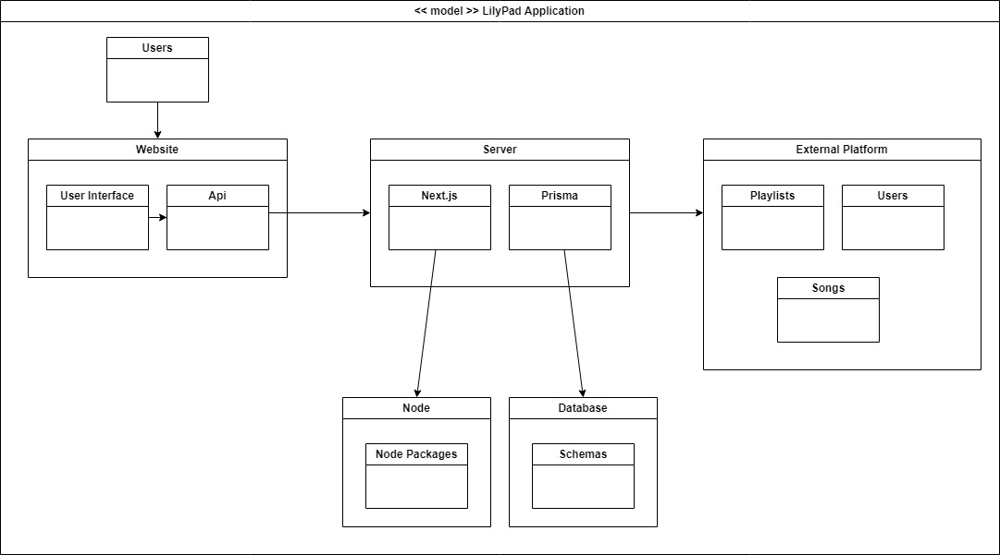

# CS386 Team 6 Deliverable 5

### Team Members:
Alan Hakala, Gannon Rowlan, Isaac Faulkner, Nathan Seitz, Rino De Guzman, Vamshi Vavilla

## 1: Description
LilyPad is a website that provides listeners with a single place to link together their favorite songs, playlists, platforms, and artists. The site provides users a way to search for songs, put them into their own playlists, and listen to them. The unique factor of LilyPad comes from the fact that it connects all the popular platforms together, meaning songs exclusive to Spotify can appear in playlists right alongside songs from Youtube and Apple Music.

## 2: Architecture
The architecture of our project is somewhat standard for Next.js apps. We have a user interface and an api that users can use to interact with the project. The api can interface with the backend server of the project, in order to make api calls to external music platforms. The server also uses Prisma to make changes in the project database, when it becomes necessary. The server interacts with node.js, to provide package support throughout the app.

## 3: Class Diagram

## 4: Sequence Diagram

## 5: Design Patterns

## 6: Design Principles