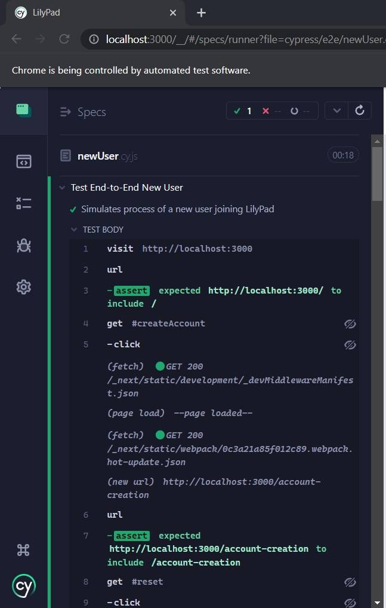

# CS386 Team 6 Deliverable 4

### Team Members:
Alan Hakala, Gannon Rowlan, Isaac Faulkner, Nathan Seitz, Rino De Guzman, Vamshi Vavilla

## 1: Introduction
LilyPad is a website that provides listeners with a single place to link together their favorite songs, playlists, platforms, and artists. The site provides users a way to search for songs, put them into their own playlists, and listen to them. The unique factor of LilyPad comes from the fact that it connects all the popular platforms together, meaning songs exclusive to Spotify can appear in playlists right alongside songs from Youtube and Apple Music.

## 2: Implemented Requirements

### 2.1: Profile Creation
Requirement: As a Listener, I want to be able to create an account so that I can make full use of LilyPad.

Issue: [Profile Creation](https://github.com/CS386Team6/LilyPad/issues/21)

Pull request: [PR 40](https://github.com/CS386Team6/LilyPad/pull/40)

Implemented by: Nathan Seitz

Approved by: Alan Hakala

### 2.2: Search Bar Feature

Requirement: As a Listener, I want a search feature so that I can find new songs.

Issue: [Search Bar](https://github.com/CS386Team6/LilyPad/issues/17)

Pull request: [PR 39](https://github.com/CS386Team6/LilyPad/pull/39)

Implemented by: Nathan Seitz

Approved by: Alan Hakala

### 2.3: Create Playlist Feature

Requirement: As a Listener, I want to be able to create a playlist so that I can have different playlists for different genres that I listen to. 

Issue: [Create Playlists]((https://github.com/CS386Team6/LilyPad/issues/9))

Pull request: [Pull Request](LINK_TO_PULL_REQUEST)

Implemented by: Alan Hakala

Approved by: Alan Hakala

### 2.4: Save Song To Playlist

Requirement: As a Listener, I want to be able to add songs into a playlist so that I can compile my favorite songs together in one place. 

Issue: [Add Songs to Playlists](https://github.com/CS386Team6/LilyPad/issues/48)

Pull request: [PR 46](https://github.com/CS386Team6/LilyPad/pull/46)

Implemented by: Rino De Guzman

Approved by: Alan Hakala

### 2.X: REQUIREMENT_NAME (Duplicate as necessary)

Requirement: As a Listener, I want ... so that I can ....

Issue: [Issue](LINK_TO_ISSUE)

Pull request: [Pull Request](LINK_TO_PULL_REQUEST)

Implemented by: DEVELOPER_NAME

Approved by: APPROVER_NAME

## 3: Tests

### 3.1: Test Framework
We chose to use Cypress for automated tests, since Next.JS, the framework we are using, had documentation for its use on its home site.

### 3.2: GitHub Tests Folder Link
[Tests Folder](https://github.com/CS386Team6/LilyPad/tree/main/cypress)

### 3.3: Example Test Case
One of the end-to-end automated tests simulates how a new user might create an account, and search for a song.
Link to file:
Classes tested during this test: [index.js](https://github.com/CS386Team6/LilyPad/blob/main/pages/index.js), [account-creation.js](https://github.com/CS386Team6/LilyPad/blob/main/pages/account-creation.js), [profile.js](https://github.com/CS386Team6/LilyPad/blob/main/pages/profile.js), and [search/index.js](https://github.com/CS386Team6/LilyPad/blob/main/pages/search/index.js)

### 3.4: Result of Tests

## 4: Adopted Technologies
We are building a web app with Node.JS, using a Next.JS framework. We chose this framework since it was easy to set up and some members had previous experience working with it.

For our database, we are using a PostgreSQL server hosted on Supabase, with server interaction though Prisma, a JavaScript library. 

Additional libraries include dotenv for integration and use of .env variables, react library functions for more robust pages, and node fetch, to make api requests.

## 5: Learning/Training
Documentation on Next.JS, Udemy courses focusing on web development, W3Schools, and Stack Overflow have all proven exceptionally helpful for learning these technologies, and overcoming errors faced during development.

## 6: Deployment
Currently, we are hosting our website on a server, with an unrelated domain name. Until we start closing in on a finished product, LilyPad will be hosted at: [Host](WEBSITE_NAME).

## 7: Licensing
We chose the GNU General Public License v3.0 for our code. Open source is important, but there may be future releases that we wish to make and keep closed-source. Since this license specifically covers that, it is perfect for our needs.

## 8: Readme File

[README.md](https://github.com/CS386Team6/LilyPad/blob/main/README.md)

[LICENSE.md](https://github.com/CS386Team6/LilyPad/blob/main/LICENSE.md)

[CODE_OF_CONDUCT.md](https://github.com/CS386Team6/LilyPad/blob/main/CODE_OF_CONDUCT.md)

## 9: Look & Feel

## 10: Lessons Learned
During the first release, one of the main things that we have learned is that there is more than meets the eye in regards to actual amounts of implementation that is required for the goals and requirements that we want to achieve. Juggling multiple technologies is a difficult task that can prevent optimal progression with the state of the project. It is also important next time around to start working on the implementation of features and requirements as soon as possible to give more time for fixing bugs. 

## 11: Demo
